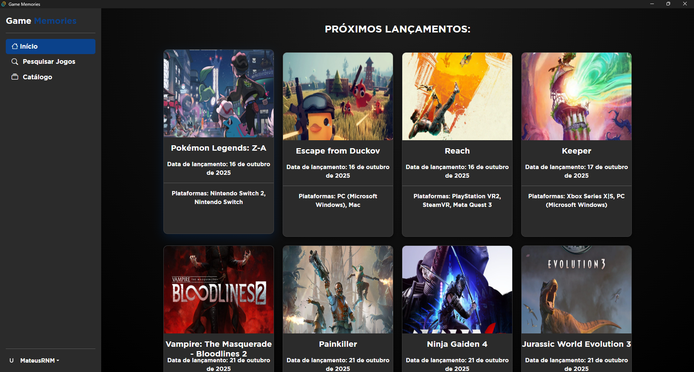
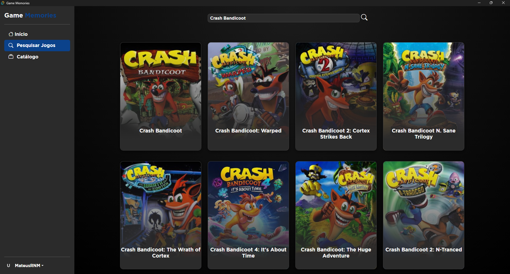
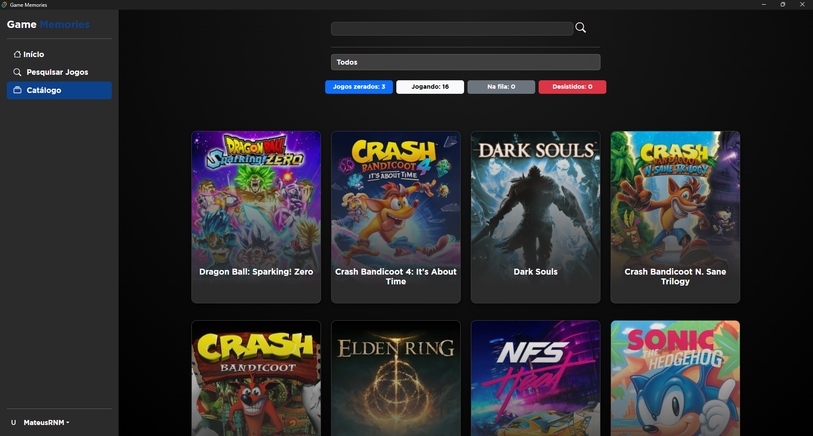
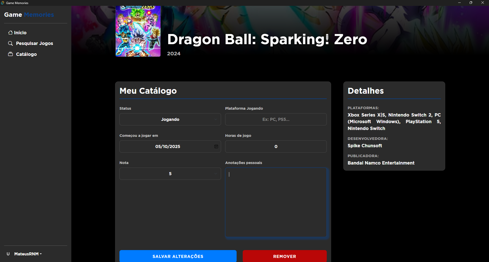

<h1 align="center">Game Memories</h1>
<h3 align="center">Apresentação básica</h3>

Este projeto se trata de um aplicativo feito para gamers que desejam catalogar jogos que estão jogando ou que já zeraram, permitindo que você visualize seu catálogo de jogos. Este projeto é 100% gratuito para utilizar e também open-source. Também aceito contribuições, sou estudante e é uma das minhas primeiras experiências desenvolvendo um projeto "completo" como esse.
  Plataformas disponíveis: Desktop e Android.

 
<b>
Um agradecimento especial ao meu amigo e professor Ápio Carnielo e Silva por ter idealizado esse projeto.
</b>

    <h3 align="center">Funcionalidades:</h3>
    <ul>
        <li>Sistema de autenticação;</li>
        <li>Pesquisar e adicionar jogos no seu catálogo pessoal;</li>
        <li>Página inicial mostrando os jogos mais próximos de lançar;</li>
        <li>Organização do catálogo com um sistema de "drag-and-drop";</li>
        <li>Tela de detalhe dos jogos;</li>
        <li>Informações nos jogos do catálogo, como: status (na fila, jogando, zerado ou desistido), horas de jogo, nota, anotações pessoais, data de início, data de zeramento e plataforma que está jogando;</li>
        <li>Salvamento do catálogo de forma local para que seja possível visualizar seu catálogo de forma offline (readonly);</li>
    </ul>

    <h3 align="center">Funcionalidades que já pretendo adicionar:</h3>
    <ul>
        <li>Sistema de exportar/importar catálogos;</li>
    </ul>

        <h3>Tecnologias utilizadas:</h3>
        

            
            
            
            
        

        
Este projeto foi desenvolvido utilizando o Svelte para o front-end em conjunto com o supabase para o back-end. Para distribuição, optei por utilizar o CapacitorJS e Tauri para empacotar o app para Android e Desktop, respectivamente. Ou seja, esse app é híbirido (construído com tecnologias web). Além disso, a API IGDB foi utilizada para realizar a busca de dados sobre os jogos.

    <h3 align="center">Screenshots:</h3>
    
 
    
 
    
 
    

